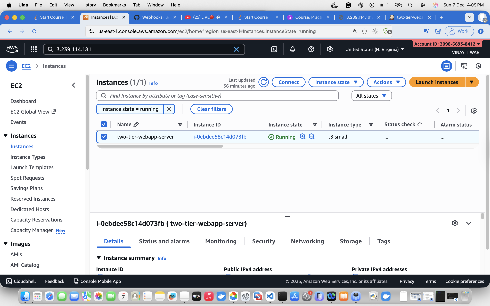
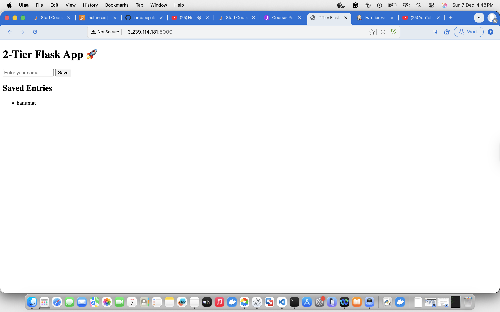
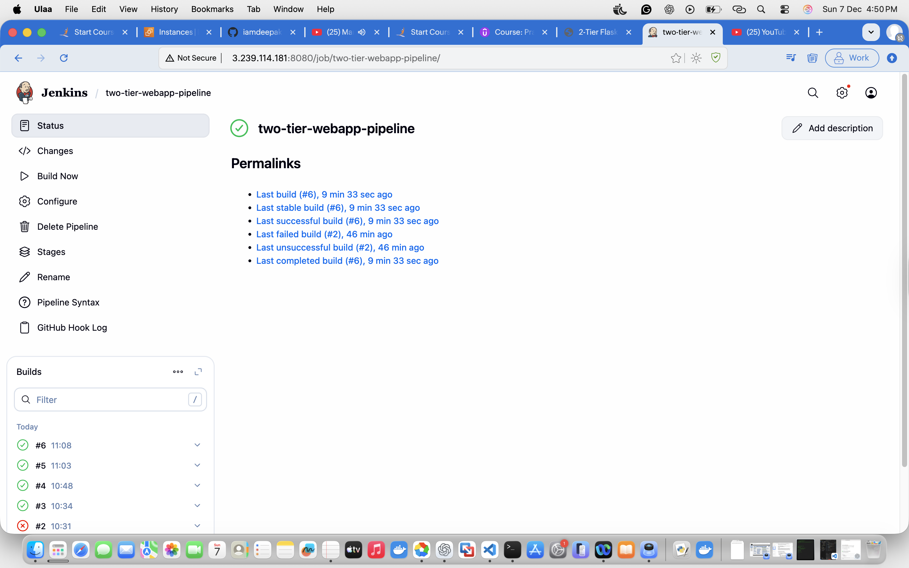

Hanumat Kripa

🚀 Two-Tier Flask Web App using Docker & Jenkins CI/CD

A fully automated 2-tier application deployed on AWS EC2 using Flask + MySQL, managed using Docker Compose and automated with a Jenkins CI/CD pipeline triggered by GitHub Webhooks.

📌 Features
	•	Flask frontend application
	•	MySQL backend database
	•	Docker containerization
	•	Docker Compose multi-container setup
	•	Jenkins CI/CD Pipeline
	•	GitHub Webhooks for automatic deployment
	•	Hosted on AWS EC2
	•	Stores user inputs in MySQL and displays saved entries

📂 Project Structure
	•	app/ → Flask app, UI, CSS, templates
	•	screenshots/ → All project screenshots
	•	docker-compose.yml → Multi-container setup
	•	Jenkinsfile → CI/CD pipeline
	•	README.md → Documentation

🛠 Tech Stack
	•	Flask (Python Web Framework)
	•	MySQL (Database)
	•	Docker & Docker Compose
	•	Jenkins Pipeline
	•	GitHub Webhooks
	•	AWS EC2

🔄 CI/CD Workflow
	1.	Developer pushes code to GitHub
	2.	GitHub Webhook notifies Jenkins
	3.	Jenkins automatically:
	•	Pulls latest code
	•	Rebuilds Docker containers
	•	Deploys updated app on EC2
	4.	Website gets updated instantly

🖼 Project Screenshots

1️⃣ EC2 Instance Screenshot

2️⃣ Flask UI Screenshot

3️⃣ Jenkins Build Success Screenshot

🌐 EC2 Deployment

🔁 GitHub Webhook (Auto Trigger)

✔️ Jenkins Build Success

🎨 Flask Application UI

🚀 Final Output
	•	Application fully deployed on EC2
	•	Jenkins pipeline working flawlessly
	•	Auto deployment on every Git push
	•	MySQL data is persistent
